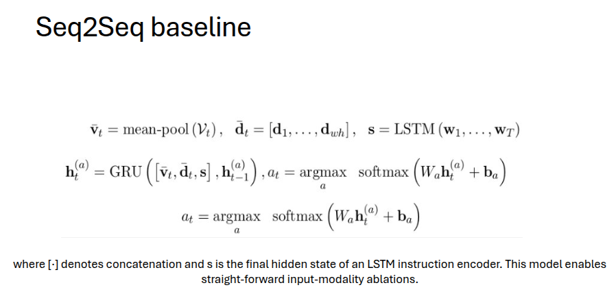
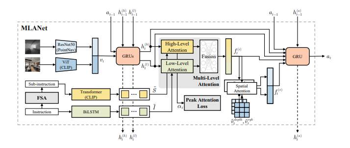

# Vision-and-Language Navigation in Continuous Environments (VLN-CE)


Implementations:

- *Beyond the Nav-Graph: Vision-and-Language Navigation in Continuous Environments* ([paper](https://arxiv.org/abs/2004.02857))
- *Waypoint Models for Instruction-guided Navigation in Continuous Environments* ([paper](https://arxiv.org/abs/2110.02207), [README](/vlnce_baselines/config/r2r_waypoint/README.md))

Vision and Language Navigation in Continuous Environments (VLN-CE) is an instruction-guided navigation task with crowdsourced instructions, realistic environments, and unconstrained agent navigation. This repo is a launching point for interacting with the VLN-CE task and provides both baseline agents and training methods. Both the Room-to-Room (**R2R**) and the Room-Across-Room (**RxR**) datasets are supported. VLN-CE is implemented using the Habitat platform.

<p align="center">
  
</p>

## Setup

This project is developed with Python 3.6. One can create an environment:

```bash
conda create -n vlnce python=3.6
conda activate vlnce
```

VLN-CE uses [Habitat-Sim](https://github.com/facebookresearch/habitat-sim/tree/v0.1.7) 0.1.7 which can be [built from source](https://github.com/facebookresearch/habitat-sim/tree/v0.1.7#installation) or installed from conda:

```bash
conda install -c aihabitat -c conda-forge habitat-sim=0.1.7 headless
```

Then install [Habitat-Lab](https://github.com/facebookresearch/habitat-lab/tree/v0.1.7):

```bash
git clone --branch v0.1.7 git@github.com:facebookresearch/habitat-lab.git
cd habitat-lab
# installs both habitat and habitat_baselines
python -m pip install -r requirements.txt
python -m pip install -r habitat_baselines/rl/requirements.txt
python -m pip install -r habitat_baselines/rl/ddppo/requirements.txt
python setup.py develop --all
```

Original code for VLN-CE:

```bash
git clone git@github.com:jacobkrantz/VLN-CE.git
cd VLN-CE
python -m pip install -r requirements.txt
```

### Data

#### Scenes: Matterport3D

Matterport3D (MP3D) scene reconstructions are used. The official Matterport3D download script (`download_mp.py`) can be accessed by following the instructions on their [project webpage](https://niessner.github.io/Matterport/). The scene data can then be downloaded:

```bash
# requires running with python 2.7
python download_mp.py --task habitat -o data/scene_datasets/mp3d/
```

Extracted such that it has the form `data/scene_datasets/mp3d/{scene}/{scene}.glb`. There are 90 scenes.

#### Episodes: Room-to-Room (R2R)

The R2R_VLNCE dataset is a port of the Room-to-Room (R2R) dataset created by [Anderson et al](http://openaccess.thecvf.com/content_cvpr_2018/papers/Anderson_Vision-and-Language_Navigation_Interpreting_CVPR_2018_paper.pdf) for use with the [Matterport3DSimulator](https://github.com/peteanderson80/Matterport3DSimulator) (MP3D-Sim). For details on porting to 3D reconstructions, please see our [paper](https://arxiv.org/abs/2004.02857). `R2R_VLNCE_v1-3` is a minimal version of the dataset and `R2R_VLNCE_v1-3_preprocessed` runs baseline models out of the box. The [dataset page](https://jacobkrantz.github.io/vlnce/data) for format, contents, and a changelog. We encourage use of the most recent version (`v1-3`).

| Dataset | Extract path | Size |
|-------------- |---------------------------- |------- |
| [R2R_VLNCE_v1-3.zip](https://drive.google.com/file/d/1T9SjqZWyR2PCLSXYkFckfDeIs6Un0Rjm/view) | `data/datasets/R2R_VLNCE_v1-3` | 3 MB |
| [R2R_VLNCE_v1-3_preprocessed.zip](https://drive.google.com/file/d/1fo8F4NKgZDH-bPSdVU3cONAkt5EW-tyr/view) | `data/datasets/R2R_VLNCE_v1-3_preprocessed` | 250 MB |

##### Encoder Weights

Baseline models encode depth observations using a ResNet pre-trained on PointGoal navigation. Those weights can be downloaded from [here](https://github.com/facebookresearch/habitat-lab/tree/v0.1.7/habitat_baselines/rl/ddppo) (672M). Extract the contents to `data/ddppo-models/{model}.pth`.


### Baseline Model

The official baseline for the RxR-Habitat Challenge is a monolingual cross-modal attention (CMA) model, labeled `Monolingual CMA Baseline` on the leaderboard. Configuration files for re-training or evaluating this model can be found in [this folder](vlnce_baselines/config/rxr_baselines) under the name `rxr_cma_{en|hi|te}.yaml`. Weights for the pre-trained models: [[en](https://drive.google.com/file/d/1fe0-w6ElGwX5VWtESKSM_20VY7sfn4fV/view?usp=sharing) [hi](https://drive.google.com/file/d/1z84xMJ1LP2NO_jpJjFdymejXQqhU6zZH/view?usp=sharing) [te](https://drive.google.com/file/d/13mGjoKyJaWSJsnoQ-el4oIAlai0l7zfQ/view?usp=sharing)] (196MB each).


### Baseline Performance

The baseline model for the VLN-CE task is the cross-modal attention model trained with progress monitoring, DAgger, and augmented data (CMA_PM_DA_Aug). As evaluated on the leaderboard, this model achieves:

| Split      | TL   | NE   | OS   | SR   | SPL  |
|:----------:|:----:|:----:|:----:|:----:|:----:|
| Test       | 8.85 | 7.91 | 0.36 | 0.28 | 0.25 |
| Val Unseen | 8.27 | 7.60 | 0.36 | 0.29 | 0.27 |
| Val Seen   | 9.06 | 7.21 | 0.44 | 0.34 | 0.32 |


## Starter Code

The `run.py` script controls training and evaluation for all models and datasets:

```bash
python run.py \
  --exp-config path/to/experiment_config.yaml \
  --run-type {train | eval | inference
```

For example, a random agent can be evaluated on 10 val-seen episodes of R2R using this command:

```bash
python run.py --exp-config vlnce_baselines/config/r2r_baselines/nonlearning.yaml --run-type eval
```

For lists of modifiable configuration options, see the default [task config](habitat_extensions/config/default.py) and [experiment config](vlnce_baselines/config/default.py) files.

### Training Agents

The `DaggerTrainer` class is the standard trainer and supports teacher forcing or dataset aggregation (DAgger). This trainer saves trajectories consisting of RGB, depth, ground-truth actions, and instructions to disk to avoid time spent in simulation.

The `RecollectTrainer` class performs teacher forcing using the ground truth trajectories provided in the dataset rather than a shortest path expert. Also, this trainer does not save episodes to disk, instead opting to recollect them in simulation.

Both trainers inherit from `BaseVLNCETrainer`.

### Models 
#### Model-1

Following is the architecture for seq2seq baseline model:

<p align ="center">
  
</p>

#### Model-1

Following is the architecture for seq2seq baseline model:

<p align ="center">
  
</p>


### Evaluating Agents

Evaluation on validation splits can be done by running `python run.py --exp-config path/to/experiment_config.yaml --run-type eval`. If `EVAL.EPISODE_COUNT == -1`, all episodes will be evaluated. If `EVAL_CKPT_PATH_DIR` is a directory, each checkpoint will be evaluated one at a time.

### Cuda

Cuda will be used by default if it is available. We find that one GPU for the model and several GPUs for simulation is favorable.

```yaml
SIMULATOR_GPU_IDS: [0]  # list of GPU IDs to run simulations
TORCH_GPU_ID: 0  # GPU for pytorch-related code (the model)
NUM_ENVIRONMENTS: 1  # Each GPU runs NUM_ENVIRONMENTS environments
```

The simulator and torch code do not need to run on the same device. For faster training and evaluation, we recommend running with as many `NUM_ENVIRONMENTS` as will fit on your GPU while assuming 1 CPU core per env.


